# Preparando o seu computador para a Engenharia de Telecomunicações

Quando se inicia em um curso de tecnologia, nem sempre as ferramentas que serão utilizadas ao longo do processo já estão prontas para uso. Na Engenharia de Telecomunicações, é comum o uso de diversas aplicações e tê-las disponíveis em seu ambiente de trabalho pode facilitar a realização de várias tarefas.

### Tabela de conteúdos

- [Sistema operacional](#sistema-operacional)
    - [Por que openSUSE Tumbleweed?](#por-que-opensuse-tumbleweed)
    - [Instalação do openSUSE](#instala%C3%A7%C3%A3o-do-opensuse)
    - [Baixe a mídia de instalação Live CD](#baixe-a-m%C3%ADdia-de-instala%C3%A7%C3%A3o-live-cd)
    - [Gravação da ISO em um pendrive](#grava%C3%A7%C3%A3o-da-iso-em-um-pendrive)
    - [Inicialização do sistema Live CD](#inicializa%C3%A7%C3%A3o-do-sistema-live-cd)
    - [Instalação do openSUSE através do script](#instala%C3%A7%C3%A3o-do-opensuse-atrav%C3%A9s-do-script)
    - [Inicializando o sistema pela primeira vez](#inicializando-o-sistema-pela-primeira-vez)
        - [Tela de login](#tela-de-login)
        - [Área de trabalho](#%C3%A1rea-de-trabalho)
            - [Instalação do GNOME](#instala%C3%A7%C3%A3o-do-gnome)
            - [Instalação do KDE](#instala%C3%A7%C3%A3o-do-kde)
- [Informações extras](#informa%C3%A7%C3%B5es-extras)
    - [Atualização do sistema](#atualiza%C3%A7%C3%A3o-do-sistema)
- [Guias para instalação e uso de aplicações](#guias-para-instala%C3%A7%C3%A3o-e-uso-de-aplica%C3%A7%C3%B5es)
    - [Avrdude](guias-de-aplicacoes/Avrdude.md)
    - [CLion](guias-de-aplicacoes/CLion.md)
    - [Compilador C++ para AVR](guias-de-aplicacoes/Compilador-para-AVR.md)
    - [Docker](guias-de-aplicacoes/Docker.md)
    - [Google Chrome](guias-de-aplicacoes/Google-Chrome.md)
    - [Gradle](guias-de-aplicacoes/Gradle.md)
    - [IntelliJ IDEA (Community e Ultimate)](guias-de-aplicacoes/IntelliJ-IDEA.md)
    - [Java Development Kit (JDK) 21](guias-de-aplicacoes/JDK-21.md)
    - [MATLAB R2015a](guias-de-aplicacoes/MATLAB.md)
    - [MPLAB X IDE](guias-de-aplicacoes/MPLAB-X-IDE.md)
    - [MQTT (Mosquitto) - Servidor e Cliente](guias-de-aplicacoes/Mosquitto.md)
    - [OBS Studio](guias-de-aplicacoes/OBS-Studio.md)
    - [Octave](guias-de-aplicacoes/Octave.md)
    - [PlatformIO](guias-de-aplicacoes/PlatformIO.md)
    - [Podman](guias-de-aplicacoes/Podman.md)
    - [Quartus Prime Lite 20.1.1](guias-de-aplicacoes/Quartus-Prime-Lite-20.1.1.md)
    - [X2Go Client](guias-de-aplicacoes/X2GoClient.md)
- [Dúvidas, sugestões ou dificuldades?](#d%C3%BAvidas-sugest%C3%B5es-ou-dificuldades)

## Sistema operacional

O sistema operacional escolhido é o [openSUSE Tumbleweed](https://get.opensuse.org/tumbleweed/), que é uma distribuição Linux, ou seja, utiliza o núcleo Linux para fazer a comunicação entre as aplicações e o *hardware* do seu computador.

Há várias outras distribuições Linux disponíveis e bem famosas, como Ubuntu, Debian, Fedora, Linux Mint, entre outros.

### Por que openSUSE Tumbleweed?

Abaixo, estão alguns motivos para a escolha do openSUSE Tumbleweed:

- Possui um ciclo de lançamento contínuo de atualizações, ou seja, basta manter o sistema atualizado que nenhuma atualização maior de versão será necessária e o sistema nunca ficará obsoleto;
- É mantido com o apoio da empresa alemã SUSE, o que dá a segurança de o projeto não ser abandonado de uma hora para outra, como ocorrem com sistemas menores, além de haver um time de desenvolvedores para manter e testar o sistema;
- *Você vai adquirir vários conhecimentos ao longo do curso, então é interessante utilizar algo além de Debian e Ubuntu, afinal, Linux é Linux e, quanto menos você se prender à ferramentas, melhor será a sua capacidade para desenvolver novas soluções.*

### Instalação do openSUSE

Para facilitar o processo de instalação e já deixar o ambiente preparado, foram criados os *scripts* [`instalacao_opensuse_tumbleweed`](https://github.com/jpmsb/preparando-computador-para-engenharia-de-tele/blob/main/instalacao_opensuse_tumbleweed) e [`instalacao_rapida_opensuse_tumbleweed`](https://github.com/jpmsb/preparando-computador-para-engenharia-de-tele/blob/main/instalacao_rapida_opensuse_tumbleweed) com a finalidade de instalar todo o sistema para você, além de pré-instalar algumas aplicações extras, como o **Visual Studio Code**, e realizar configurações adicionais que precisariam ser realizadas manualmente pelo usuário.

Caso você já possua outro sistema em seu computador, será necessário ajustar as partições do seu armazenamento de modo a criar um espaço suficiente para instalar o openSUSE. A maioria das pessoas geralmente possui o Windows instalado. Você será guiado ao longo do processo.

### Baixe a mídia de instalação Live CD

O primeiro passo para conseguir utilizar a rotina de instalação presente neste repositório é baixar a ISO Live CD do openSUSE Tumbleweed. Para tal, você pode utilizar o link abaixo:

 - [openSUSE Tumbleweed XFCE Live CD](https://download.opensuse.org/tumbleweed/iso/openSUSE-Tumbleweed-XFCE-Live-x86_64-Current.iso)

### Gravação da ISO em um pendrive

Para gravar a ISO em um pendrive, você pode utilizar o [Balena Etcher](https://www.balena.io/etcher/), que é uma ferramenta multiplataforma e muito simples de ser utilizada.

### Inicialização do sistema Live CD

Com o pendrive já gravado, você pode reiniciar o seu computador e acessar o *boot menu* para selecionar o pendrive como dispositivo de inicialização. A tecla para acessar o *boot menu* varia de acordo com o fabricante do seu computador. Abaixo, estão listadas as teclas de acesso ao *boot menu* que são típicas de alguns fabricantes:

- **Acer**: F12 ou F9
- **Asus**: ESC ou F8
- **Dell**: F12 
- **HP**: F9 ou ESC
- **Lenovo**: F8, F10 ou F12
- **Samsung**: F12 ou ESC

Uma vez o sistema inicializado, você terá acesso à uma àrea de trabalho semelhante à imagem abaixo:

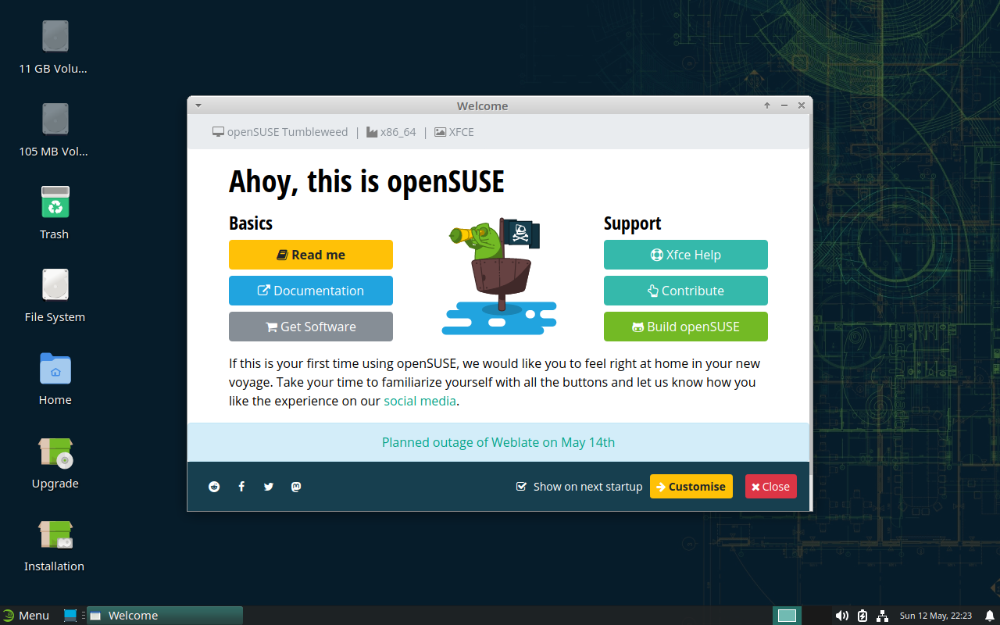

Note que o idioma do sistema está em inglês. A disposição do teclado está com o padrão estadunidense. Entretanto, o sistema que será instalado no seu computador estará totalmente traduzido para o Português do Brasil e com a disposição de teclado para ABNT2.

Você pode fechar a janela de boas-vindas. Para acessar o terminal, clique no "Menu", localizado no canto inferior esquerdo da tela, e clique no ícone com o título "Terminal Emulator":

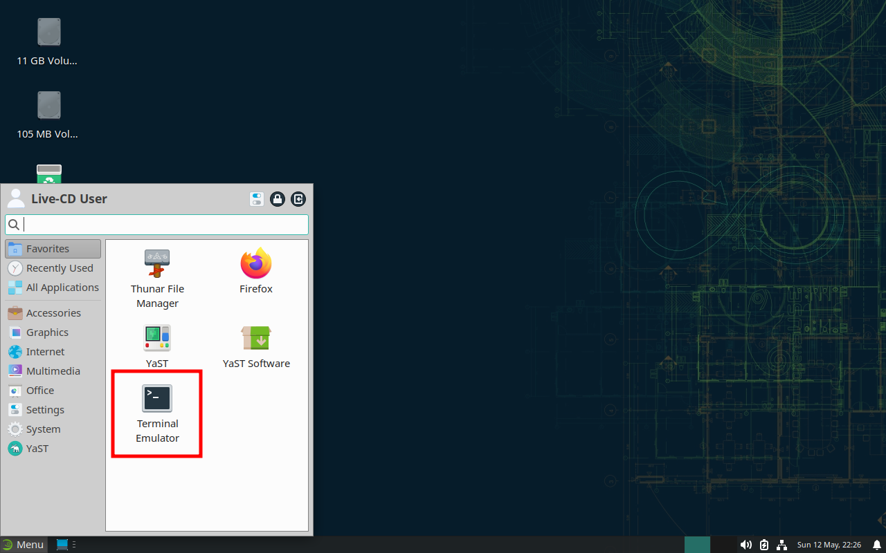


Com o terminal aberto, copie e cole (botão direito &rarr; "paste" ou Ctrl+Shift+V) o conteúdo abaixo para preparar o ambiente:

```bash
sudo -n zypper install -y --force glibc-locale glibc-locale-base gparted; gtk-launch xfce4-terminal.desktop ; exit
```

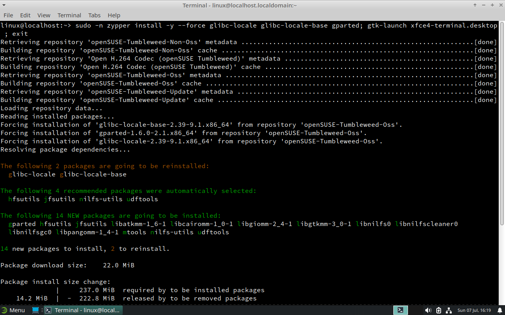

Após o processo ser finalizado, uma nova janela de terminal vazia será aberta:

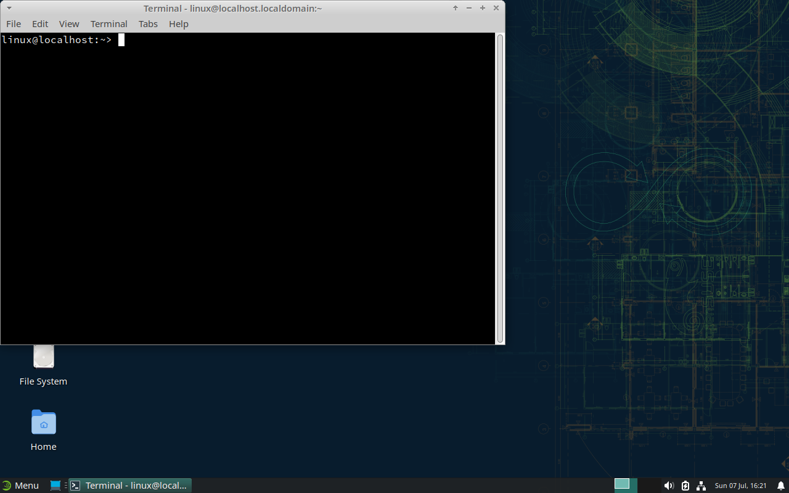

Execute o `gparted` com o comando:

```bash
gparted
```

Com o `gparted` aberto, você poderá redimensionar as partições do seu armazenamento para criar um espaço suficiente para instalar o openSUSE. Na imagem abaixo é exemplificado o `gparted` com uma partição de 10 GB para o openSUSE:

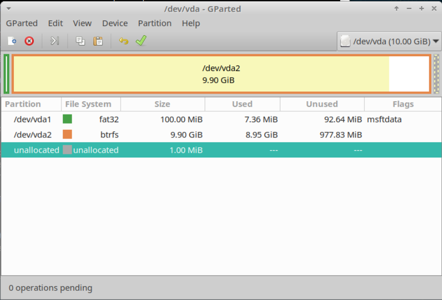

É preciso ter cautela ao redimensionar as partições, pois qualquer erro pode resultar na perda de dados. Caso você não tenha experiência com particionamento de discos, é recomendável pedir ajuda. Se você estiver no começo do curso, **recomenda-se uma partição de pelo menos 200 GB**. **A instalação completa do sistema seguindo este guia ocupa cerca de 10 GB.**

Com relação ao tipo de partição, você pode escolher entre EXT4 e BTRFS. O BTRFS é um sistema de arquivos mais moderno e com mais recursos, como snapshots, compressão de dados, entre outros. Entretanto, o EXT4 é mais estável e mais utilizado. **Caso você não tenha certeza, escolha o EXT4**.

Se você possuir o Windows instalado, basta clicar com o botão direito em cima da partição do tipo NTFS e selecionar a opção "Rezise/Move". Em seguida, arraste a barra para redimensionar a partição. Após isso, clique no botão "&rarr; Resize/Move" para aplicar as mudanças. Na imagem abaixo, é mostrado um exemplo da tela de redimensionamento de uma partição NTFS:

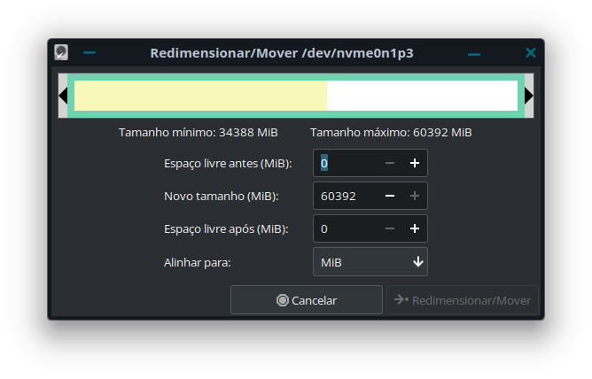

Após realizadas as mudanças, você pode fechar o `gparted`. Voltando ao terminal, baixe o *script* de instalação com o comando:

### Instalação do openSUSE através do script

- **Instalação rápida (recomendada)**

    Para baixar a rotina de instalação rápida, utilize o comando abaixo no terminal:

    ```bash
    wget https://raw.githubusercontent.com/jpmsb/preparando-computador-para-engenharia-de-tele/main/instalacao_rapida_opensuse_tumbleweed -O instalacao_opensuse_tumbleweed
    ```

    <details>
        <summary>Mais informações</summary>

    Neste tipo de instalação, uma raiz do sistema criada previamente é baixada e extraída para a partição de destino, diminuindo o tempo que seria gasto baixando e instalando cada pacote separadamente. Os arquivos compactados estão na seção "Releases" e são gerados automaticamente a cada novo lançamento de _snapshots_ do openSUSE Tumbleweed.
    </details>

- Instalação customizável

    Para baixar a rotina de instalação, utilize o comando abaixo no terminal:

    ```bash
    wget https://raw.githubusercontent.com/jpmsb/preparando-computador-para-engenharia-de-tele/main/instalacao_opensuse_tumbleweed -O instalacao_opensuse_tumbleweed
    ```

    <details>
        <summary>Mais informações</summary>

    Neste tipo de instalação, os pacotes são baixados um por um diretamente dos repositórios. Além disso, esses pacotes são instalados um por um, o que aumenta consideravelmente o tempo de instalação do sistema operacional. Essa rotina é recomendada caso queira customizar quais pacotes serão instalados ou algum outro aspecto da instalação, já que a rotina pode ser totalmente editada antes de ser executada.
    </details>

Para executar o *script*, eleve para o usuário `root` com o comando:

```bash
sudo su
bash instalacao_opensuse_tumbleweed
```

Basta seguir as instruções e responder as perguntas que o *script* fará. Abaixo, é mostrada uma captura de tela com essa etapa inicial:


Abaixo, é explicado o significado de algumas perguntas:

 - **Partição onde o sistema será instalado [ex.: sda2]:**: você deve informar a partição onde o openSUSE será instalado. Recomenda-se pelo 200 GB de espaço caso você esteja no começo do curso. Além disso, a partição deve estar formatada como EXT4 ou BTRFS;
 - **Partição de inicialização EFI [ex.: sda1]:**: você deve informar a partição EFI, que é onde o *bootloader* será instalado;
 - **Nome do computador:**: não pode conter espaços e identificará o seu computador na rede. No exemplo da imagem acima, o nome do computador é `um-teste`;
 - **A instalação será realizada em um notebook? [S/N]**: caso você esteja instalando em um notebook, digite "S" e confirme com "Enter".

Após confirmar que os dados estão corretos, digite "S" e confirme com "Enter". Basta esperar a rotina finalizar o processo de instalação que, dependendo do tipo escolhido (rápida ou customizável), pode levar em torno de 10 a 60 minutos, sendo que esse tempo pode variar de acordo com a velocidade de *download* da sua Internet, velocidade do seu processador, ou se você utiliza HD ou SSD como armazenamento. É preciso manter a conexão com a internet ativa durante todo o processo.

Ao final da rotina de instalação, caso veja a mensagem:

```
Tudo pronto!! Digite "sudo reboot" para reiniciar o seu computador.
```

Você pode reiniciar o seu computador com o comando:

```bash
sudo reboot
```

### Inicializando o sistema pela primeira vez

Na próxima inicialização, você deverá ter um menu de *boot* semelhante ao da imagem abaixo:

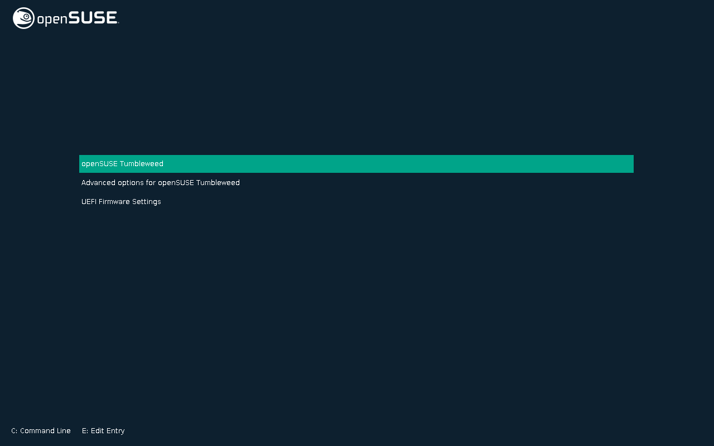

Caso possua o Windows instalado, o mesmo será listado no menu para que você possa escolhê-lo. Use as setas direcionais para trocar de opção.

#### Tela de login

Ao iniciar o sistema, você será apresentado à tela de login, conforme ilustrado abaixo:

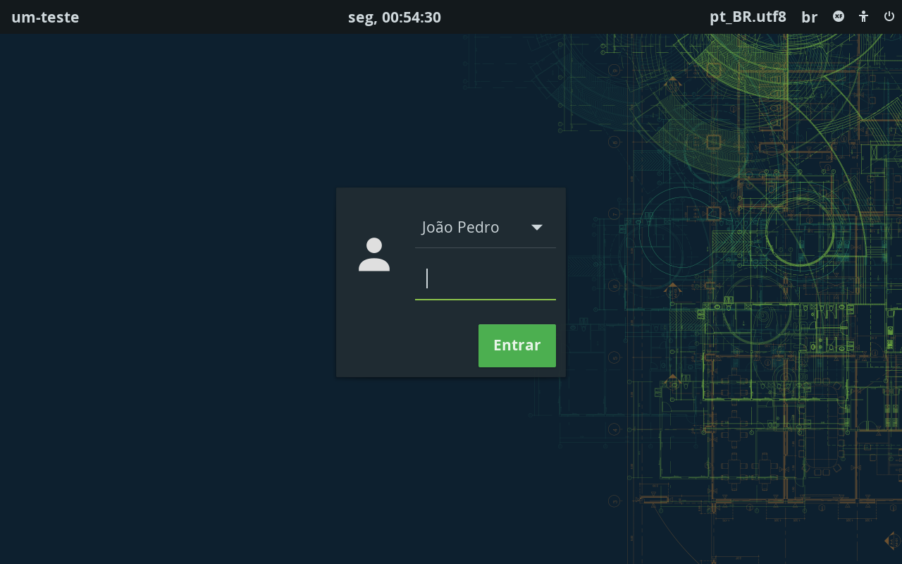

#### Área de trabalho

Após inserir suas credenciais, você será direcionado à área de trabalho do openSUSE Tumbleweed, conforme ilustrado abaixo:

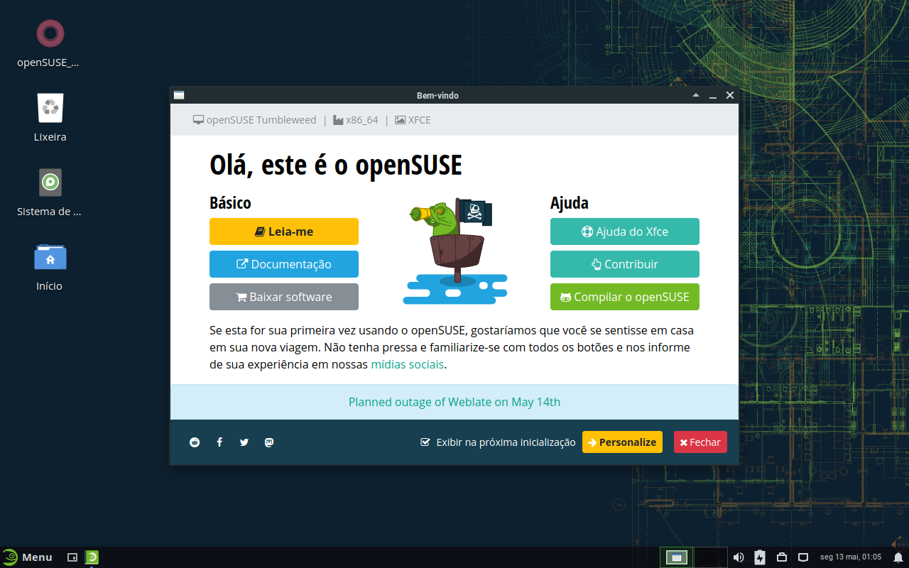

A interface gráfica escolhida é o XFCE, que é uma interface leve e muito customizável. Você pode personalizar a interface gráfica conforme a sua preferência.

Caso queira, também é possível instalar outras interfaces gráficas, como KDE, GNOME, entre outras.

##### Instalação do GNOME

O GNOME é uma interface gráfica muito popular e utilizada em várias distribuições Linux, incluindo o famoso Ubuntu. Para instalar o GNOME, basta executar o comando:

```bash
sudo zypper install -t pattern gnome
```

Após a instalação, reinicie o sistema. Você verá que a tela de login estará diferente. O gestor de login que é instalado nesse processo é o GDM.

##### Instalação do KDE

O KDE (chamado de Plasma) é outra interface que é muito popular e é mais customizável que o GNOME. Além disso, é mais familiar ao Windows. Para instalar o KDE Plasma, basta executar o comando:

```bash
sudo zypper install -t pattern kde_plasma
```

Após a instalação, reinicie o sistema. Você verá que a tela de login estará diferente. O gestor de login que é instalado nesse processo é o SDDM.

## Informações extras

O interpretador de comandos utilizado é o FISH (Friendly Interactive SHell), que é amigável e fácil de ser utilizado. Possui recursos de autocompletar e sugestões de comandos. Além disso, caso um comando não exista, o mesmo é destacado em vermelho.

Adicionalmente, há algumas aplicações de terminal que podem facilitar a sua vida, como por exemplo o `cnf`, que indica qual pacote você deve instalar para disponibilizar um comando:


Outro comando útil é o `tldr`, que mostra exemplos de uso de comandos:

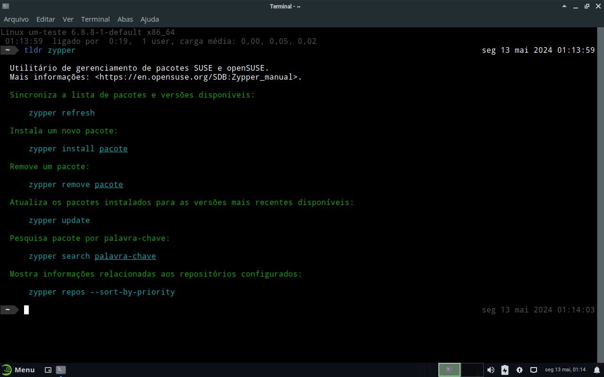

### Atualização do sistema

Conforme mostrado na imagem acima, o Zypper é o gerenciador de pacotes do openSUSE. Com ele, você pode procurar, instalar, atualizar e remover pacotes do sistema. Note que para atualizar o openSUSE Tumbleweed, o comando é:

```bash
sudo zypper dist-upgrade
```
ou
```bash
sudo zypper dup
```

Porém, a forma recomendada é utilizar o script [`atualizar-sistema`](scripts-auxiliares/atualizar-sistema), que facilita o processo e pode ser executado com o comando abaixo:

```bash
atualizar-sistema
```

Você **não** precisará executar o comando de atualização manualmente. Assim que houver atualizações disponíveis, o sistema irá notificá-lo. O símbolo que indica que há atualizações disponíveis é um ícone de seta para cima, localizado no canto inferior direito da tela, conforme ilustrado abaixo:

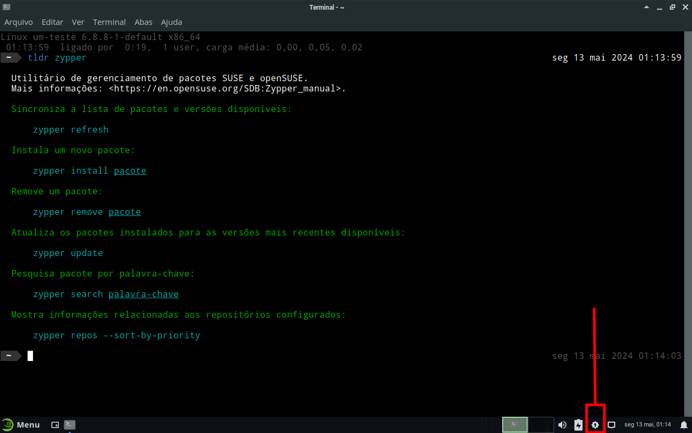

Como o openSUSE Tumbleweed é uma distribuição *rolling release*, é comum receber notificação de atualizações diariamente e até múltiplas vezes ao dia. Entretanto, você não precisa atualizar de imediado, podendo fazê-lo quando for mais conveniente, como, por exemplo, uma vez por semana, uma vez a cada duas semanas ou até mesmo até uma vez por mês.

Ao tentar atualizar o sistema, caso ocorra o erro semelhante ao abaixo:


basta tentar novamente dentro de alguns dias. Isso ocorre por conta de alguns repositórios ainda não terem sincronizado. Nenhuma outra ação é necessária.

## Guias para instalação e uso de aplicações

Abaixo estão listados guias onde será explicado como instalar algumas aplicações utilizadas ao longo do curso, além de ferramentas adicionais. O objetivo é descomplicar o processo de deixar essas ferramentas preparadas para uso.

- [Avrdude](guias-de-aplicacoes/Avrdude.md)
- [CLion](guias-de-aplicacoes/CLion.md)
- [Compilador para AVR](guias-de-aplicacoes/Compilador-para-AVR.md)
- [Docker](guias-de-aplicacoes/Docker.md)
- [Google Chrome](guias-de-aplicacoes/Google-Chrome.md)
- [Gradle](guias-de-aplicacoes/Gradle.md)
- [IntelliJ IDEA (Community e Ultimate)](guias-de-aplicacoes/IntelliJ-IDEA.md)
- [Java Development Kit (JDK) 21](guias-de-aplicacoes/JDK-21.md)
- [MATLAB R2015a](guias-de-aplicacoes/MATLAB.md)
- [MPLAB X IDE](guias-de-aplicacoes/MPLAB-X-IDE.md)
- [MQTT (Mosquitto) - Servidor e Cliente](guias-de-aplicacoes/Mosquitto.md)
- [OBS Studio](guias-de-aplicacoes/OBS-Studio.md)
- [Octave](guias-de-aplicacoes/Octave.md)
- [PlatformIO](guias-de-aplicacoes/PlatformIO.md)
- [Podman](guias-de-aplicacoes/Podman.md)
- [Quartus Prime Lite 20.1.1](guias-de-aplicacoes/Quartus-Prime-Lite-20.1.1.md)
- [X2Go Client](guias-de-aplicacoes/X2GoClient.md)

## Dúvidas, sugestões ou dificuldades?

Caso tenha alguma dúvida, sugestão ou tenha enfrentado alguma dificuldade, sinta-se à vontade para abrir uma [_issue_](https://github.com/jpmsb/preparando-computador-para-engenharia-de-tele/issues) e fornecer mais informações.