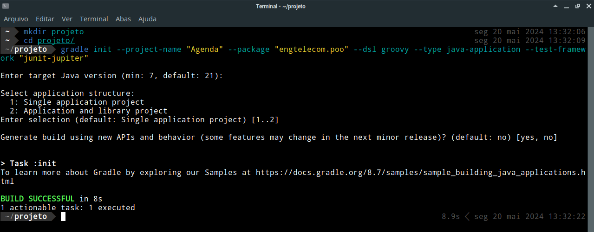
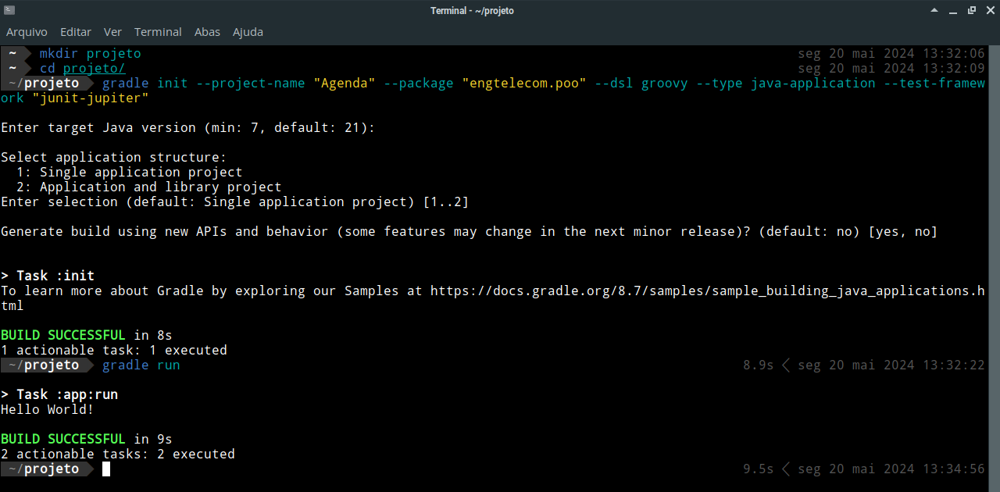

# Gradle

O [Gradle](https://gradle.org/) é uma ferramenta de código aberto que fornece suporte para a automação de compilação, teste, publicação e implantação de software.

### Tabela de Conteúdos

- [Instalação](#instalação)
- [Uso](#uso)

## Instalação

Para o facilitar o processo de instalação do Gradle, foi criado um *script* que realiza tal processo, obtendo a versão mais recente da ferramenta. A rotina pode ser chamada com o comando

```bash
instalar-gradle
```

Será perguntada pela sua senha de usuário definida durante a instalação do openSUSE. Após a instalação, você pode verificar se o Gradle foi instalado corretamente com o comando:

```bash
gradle --version
```

A saída é semelhante à abaixo:


## Uso

Para criar um novo projeto Gradle, em um diretório vazio, execute o seguinte comando:

```bash
gradle init
```

Serão realizadas algumas perguntas para a configuração inicial. Algumas dessas perguntas podem já ser preenchidas através de argumentos de linha de comando. No exemplo abaixo, é criado um projeto Java com o nome "Agenda" e pacote "engtelecom.poo":

```bash
gradle init --project-name "Agenda" --package "engtelecom.poo" --dsl groovy --type java-application --test-framework "junit-jupiter"
```



Note que na imagem acima é possível verificar que algumas perguntas ainda são feitas. Basta apenas pressionar "Enter" para aceitar a opção padrão.

Com o projeto criado, já há um programa de exemplo que pode ser compilado e executado. Para tal, garanta que você possui o JDK (Java Development Kit) instalado, consultando o guia [aqui](JDK-21.md). Feito isso, utilize o seguinte comando dentro do diretório da aplicação:

```bash
gradle run
```

O programa será compilado e executado, exibindo a seguinte saída no terminal:

