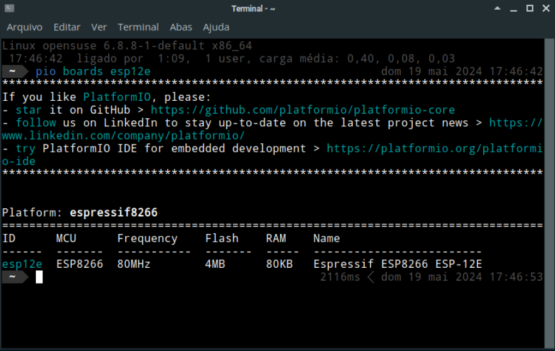

# PlatformIO

O PlatformIO provê uma plataforma unificada para desenvolvimento de sistemas embarcados, que inclui suporte a diversas placas e microcontroladores.

### Tabela de conteúdos
- [Instalação](#instalação)
- [Utilização](#utilização)
  - [Criando um projeto](#criando-um-projeto)
    - [Adição de bibliotecas](#adição-de-bibliotecas)
    - [Utilização de variáveis de ambiente](#utilização-de-variáveis-de-ambiente)
  - [Compilando o projeto](#compilando-o-projeto)
    - [Compilação e gravação na placa](#compilação-e-gravação-na-placa)
    - [Compilação com uso de variáveis de ambiente](#compilação-com-uso-de-variáveis-de-ambiente)
  - [Conexão serial](#conexão-serial)
    - [Monitorar saída](#monitorar-saída)
    - [Entrada de dados](#entrada-de-dados)

## Instalação

Para instalar o PlatformIO, basta executar o comando:

```bash
sudo zypper install python313-platformio
```

## Utilização

### Criando um projeto

Para criar um novo projeto, basta utilizar o seguinte comando:

```
pio project init --ide vim --board esp32dev
```

Nesse caso, a placa escolhida é a Espressif ESP32 Dev Module. Para ver a lista de placas suportadas, execute o comando:

```
pio boards
```

Você pode filtrar a lista de placas especificando um termo de busca, por exemplo:

```
pio boards esp12e
```



Com o projeto criado, o diretório do mesmo terá a seguinte estrutura inicial:

```
├── include
│   └── README
├── lib
│   └── README
├── platformio.ini
├── src
│   └── ...
└── test
    └── README
```

Dentro do diretório `src`, será onde os arquivos de código fonte do projeto serão armazenados. O arquivo de código fonte principal do projeto é o `main.cpp`.

No arquivo "platformio.ini" há as especificações do projeto. O arquivo não modificado possui um conteúdo similar ao seguinte:

```
; PlatformIO Project Configuration File
;
;   Build options: build flags, source filter
;   Upload options: custom upload port, speed and extra flags
;   Library options: dependencies, extra library storages
;   Advanced options: extra scripting
;
; Please visit documentation for the other options and examples
; https://docs.platformio.org/page/projectconf.html

[env:esp32dev]
platform = espressif32
board = esp32dev
framework = arduino
```

#### Adição de bibliotecas

Para adicionar bibliotecas ao projeto, basta adicionar a linha `lib_deps` no arquivo `platformio.ini`. Por exemplo, para poder fazer uso do sensor DHT11, bem como do cliente MQTT, é preciso adicionar as dependências abaixo:

```
lib_deps = 
  adafruit/DHT sensor library@^1.4.4
  adafruit/Adafruit Unified Sensor@^1.1.9
  knolleary/PubSubClient@^2.8
  arduino-libraries/ArduinoMqttClient@^0.1.7
```

O arquivo `platformio.ini` completo ficará similar ao seguinte:

```
; PlatformIO Project Configuration File
;
;   Build options: build flags, source filter
;   Upload options: custom upload port, speed and extra flags
;   Library options: dependencies, extra library storages
;   Advanced options: extra scripting
;
; Please visit documentation for the other options and examples
; https://docs.platformio.org/page/projectconf.html

[env:esp32dev]
platform = espressif32
board = esp32dev
framework = arduino
lib_deps = 
  adafruit/DHT sensor library@^1.4.4
  adafruit/Adafruit Unified Sensor@^1.1.9
  knolleary/PubSubClient@^2.8
  arduino-libraries/ArduinoMqttClient@^0.1.7
```

#### Utilização de variáveis de ambiente

Como forma de deixar o código mais organizado e sem a presença de informações sensíveis, como nomes de usuário e senhas, é possível utilizar variáveis de ambiente para armazenar essas informações. No exemplo abaixo, o arquivo `platformio.ini` foi modificado, adicionado a listagem `build_flags =`, de forma a utilizar variáveis de ambiente para armazenar o SSID e a senha da rede Wi-Fi, bem como o endereço, porta, usuário e senha do servidor MQTT:

```
[env:esp32dev]
platform = espressif32
board = esp32dev
framework = arduino
lib_deps = 
  adafruit/DHT sensor library@^1.4.4
  adafruit/Adafruit Unified Sensor@^1.1.9
  knolleary/PubSubClient@^2.8
  arduino-libraries/ArduinoMqttClient@^0.1.7

build_flags =
  -DBROKER_SERVER='"${sysenv.BROKER_SERVER}"'
  -DBROKER_PORT=1883
  -DBROKER_USER='"${sysenv.BROKER_USER}"'
  -DBROKER_PASS='"${sysenv.BROKER_PASS}"'
  -DWIFI_SSID='"${sysenv.WIFI_SSID}"'
  -DWIFI_PASS='"${sysenv.WIFI_PASS}"'
  -DDEVICE_ID='"${sysenv.DEVICE_ID}"'
  -DDEVICE_NAME='"${sysenv.DEVICE_NAME}"'
```

Note que a variável `BROKER_PORT` foi definida diretamente no arquivo `platformio.ini`. Isso mostra que é possível definir o valor de variáveis tanto diretamente no arquivo de configuração do projeto quanto obter o valor a partir de variáveis de ambiente do sistema operacional.

Para utilizar as variáveis de ambiente no seu programa, no arquivo de código fonte `main.cpp`, você pode adicionar as seguintes linhas:

```cpp
char brokerServer[] = BROKER_SERVER;
int brokerPort = BROKER_PORT;
char brokerUser[] = BROKER_USER;
char brokerPass[] = BROKER_PASS;
char SSID[] = WIFI_SSID;
char PASS[] = WIFI_PASS;
```

### Compilando o projeto

A compilação é realizada executando o seguinte comando dentro do diretório do projeto:

```
pio run
```

Com todas as bibliotecas corretamente adicionadas no arquivo "platformio.ini", caso ainda não estejam baixadas e disponíveis para uso, serão obtidas na Internet automaticaticamente quando o projeto for compilado.

#### Compilação e gravação na placa

Para compilar e gravar o código na placa, basta executar o comando no diretório do projeto:

```
pio run -t upload
```

Você também pode especificar em qual dispositivo a gravação será realizada, utilizando a opção `--upload-port`:

```
pio run -t upload --upload-port /dev/ttyUSB0
```

#### Compilação com uso de variáveis de ambiente

Para compilar o projeto definindo valores para variáveis de ambiente, basta especificá-las antes do comando citado anteriormente. No exemplo abaixo, serão definidos valores para as variáveis `WIFI_SSID`, `WIFI_PASS`, `BROKER_SERVER`, `BROKER_USER` e `BROKER_PASS`:

```
WIFI_SSID="Nome da rede" WIFI_PASS="senha" BROKER_SERVER="mqtt.exemplo.com" BROKER_USER="usuario" BROKER_PASS="senha" pio run -t upload
```

No comando acima, o código é compilado e gravado na primeira placa disponível.

### Conexão serial

#### Monitorar saída

Para monitorar a saída pela conexão serial, basta utilizar o seguinte comando:

```
pio device monitor
```

A velocidade padrão da porta serial é assumida em 9600 bit/s. Para especificar uma velocidade diferente, basta utilizar argumento "--baud velocidade", conforme mostrado abaixo:

```
pio device monitor --baud 115200
```

#### Entrada de dados

Caso queira-se inserir uma certa quantidade dados, basta utilizar o comando citado acima, com o argumento adicional `-f send_on_enter`, que enviará os dados apenas quando o usuário teclar "Enter". Porém, o que é digitado não é mostrado ao usuário em tempo real. Para exibir o que se é digitado, basta acrescentar o argumento `--echo`. O comando final fica conforme abaixo:

```
pio device monitor --baud 115200 --echo -f send_on_enter
```

Ainda é possível utilizar outros filtros, especificados no argumento "-f". O "colorize" é um filtro interessante, pois adiciona cores diferentes para o que foi digitado e o que foi obtido do programa em execução:

```
pio device monitor --baud 115200 --echo -f send_on_enter -f colorize
```

Outro filtro interessante é o `esp32_exception_decoder`, que consegue traduzir alguns códigos de erro do ESP32:

```
pio device monitor --baud 115200 --echo -f send_on_enter -f colorize -f esp32_exception_decoder
```